<h1 align="center">Benjamin Charmes</h1>

  

  
  &nbsp;
  
  &nbsp;
  
  &nbsp;
  

---

Based in **Marseille**, chemist turned developer — Master's in Chemistry from Aix-Marseille University, a few years teaching Physics & Chemistry, then software full-time. I currently work as a Fullstack Consultant at [Abylsen](https://www.abylsen.com/) and contribute as a freelance developer to [Datalab](https://github.com/datalab-org), an open-source data management platform built with the University of Cambridge.

---

## 🚀 Projects

### Personal

| Project | Description |
|---|---|
| **[Tessera](https://github.com/BenjaminCharmes/tessera)** | Self-hosted multi-project IDE with AI agent orchestration — agents write and ship code on real branches |

### Freelance — open source

Open-source projects I contribute to as a freelance developer for [Datalab Industries](https://github.com/datalab-org).

| Project | Description |
|---|---|
| **[Datalab](https://github.com/datalab-org/datalab)** | Open-source platform for managing, sharing and analysing research data in chemistry labs — University of Cambridge |
| **[datalab-app-plugin-insitu](https://github.com/datalab-org/datalab-app-plugin-insitu)** | In-situ NMR analysis plugin for Datalab |

---

## 🛠 Stack

**Frontend**

**Backend & Data**

**DevOps**

**AI**

---

## 📊 GitHub Stats

  <picture>
    <source media="(prefers-color-scheme: dark)" srcset="profile/stats-dark.svg">
    
  </picture>
  <picture>
    <source media="(prefers-color-scheme: dark)" srcset="profile/top-langs-dark.svg">
    
  </picture>

  <picture>
    <source media="(prefers-color-scheme: dark)" srcset="profile/streak-dark.svg">
    
  </picture>

